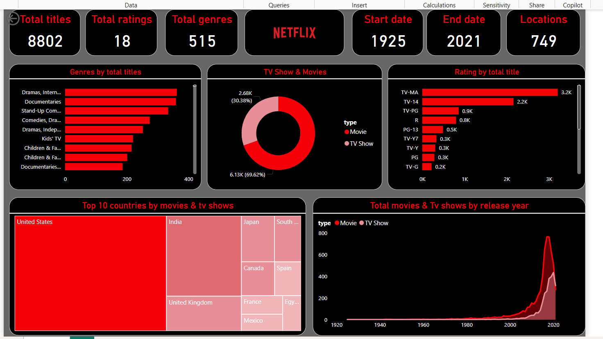

## 📌 Objective

The goal of this project is to analyze viewership patterns of Netflix series and gain insights such as:

- Most watched series by genre and region
- Viewership trends over time
- Impact of release time, season count, or ratings on popularity
- Demographics and preferences of the Netflix audience

## 🔧 Tools & Technologies

- **Power BI** (for interactive dashboards)

## 📊 Sample Visuals

Add these in a folder named `visuals/` and embed like this:

### 🧾 Top 10 Most Watched Netflix Series



### 📅 Monthly Viewership Trend

> _Make sure to include clean and meaningful chart titles in your actual images!_

## 🧠 Key Insights

- Action and drama genres dominate top viewership charts.
- Series released during holiday seasons see a significant spike in views.
- Shows with shorter seasons (6–8 episodes) tend to have higher completion rates.
- User ratings positively correlate with series longevity.

## 📈 Power BI Dashboard Preview


> Add a screenshot of your dashboard here (save as PNG or JPG).

## 🧪 How to Run This Project

1. Clone this repo:
   ```bash
   git clone https://github.com/yourusername/netflix-viewership-analysis.git
   cd netflix-viewership-analysis
